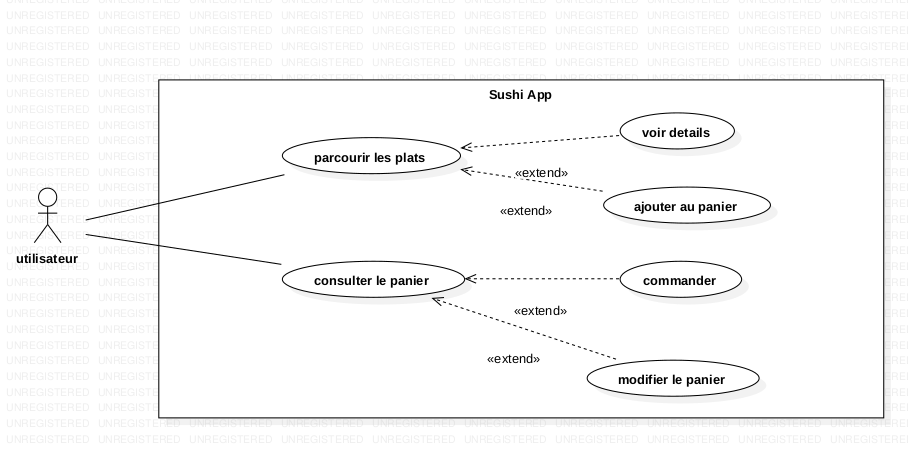
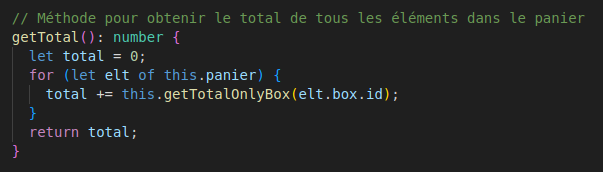
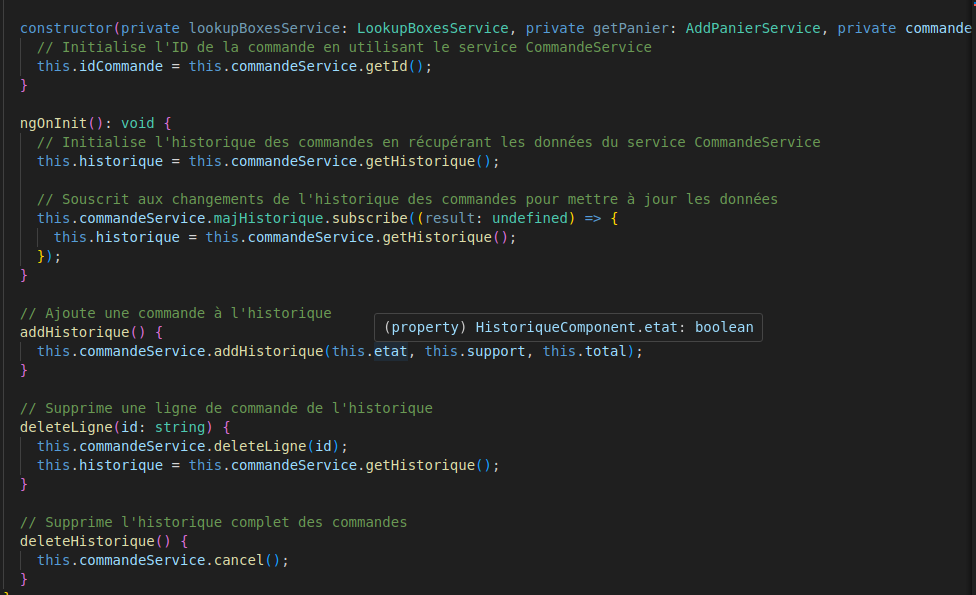

= Compte-rendu Jeu Kotlin
:toc:
== Sommaire

Réalisé par :

- CHONG TOUA Joshua

Date début : 03/2024

== Contexte

Projet de seconde année
de BTS SIO, le but est de créer SushiApp qui est une application pour commander
des sushis.

== Introduction
Pour démarrer le projet, on a créé des maquettes pour pouvoir être
guidé tout au long du projet.

== Maquettes

image::img/mRgpd.png[]

== Récupération Api

Pour obtenir les données des boites de sushis, on a récupéré le dossier contenant l'api
sushis.

On obtient:

== Header

Pour démarrer le projet, la première chose que j'ai créé était le header.
Il contient la page qui nous amène à la séléction de sushi , le panier et
l'historique des commandes.

Code HTML :

Rendu :

== Footer

Le footer contient un bouton (rouge) pour réinitialiser le panier, un bouton rgpd
qui nous affiche le texte rgpd et un bouton (vert) contenant le prix
total de la commande et lors d'un click il nous mène sur la page panier.

Le total de la commande est obtenu grâce à l'appel d'une fonction dans le fichier ts de
footer qui va utiliser la méthode du service panier.

Fichier TypeScript :

image::img/footer/ts.png[]

Fichier Service :

Rendu :

== La page principale

Sur la page principale, on y trouve toutes les boites de sushis présentent dans l'api.

Dans les boxes on peut y trouver:

- le prix de la boite

- le nom de la boite

- le nombre de pièces dans la boite

- la quantité de boite qu'on a ajouté dans le panier

- un bouton plus (+) pour ajouter dans le panier

- un bouton moins (-) pour retirer du panier qui se limite à la valeur 1

- un bouton poubelle pour supprimer la/les boites du panier

== Panier

On peut retrouver un panier sur la page principale en cliquant sur le bouton gris
à gauche de la page, ou sur le chariot en haut à droite de la page ou sur le bouton total
en bas à droite de la page.

En cliquant sur le bouton "Valider Commande", un modal nous demande si on est sur de
valider la commande puis le numéro de commande est créé.

image::img/panier/ncommande.png[]

Code TypeScript pour générer le numéro de commande :

== Historique

Pour accèder à l'historique, il suffit de cliquer sur le chronomètre
dans le header.

A l'intérieur, on peut y trouver toute les commandes qui ont été passé.

Code HTML :

Code TypeScript :

Code du Service :

image::img/historique/service.png[]

== RGPD

Pour accèder à la page RGPD, il suffit de cliquer sur le "rgpd"
dans le footer.

Sur la page, on y trouve le texte RGPD.

== Problèmes rencontrés

Tout au long de ce projet, j'ai pu rencontrer des problèmes :

- La compréhension du fonctionnement d'Angular

- Le fonctionnement des Services avec les fichier TypeScript des components

- L'utilisatation du localStorage.

== Conclusion

Pour conclure, ce projet a apporté des points positifs à ma formation car
il m'a permis de découvrir un nouveau language (TypeScript, Angular)
et de m'améliorer en front-end.

== Lien

Lien github: https://github.com/JoshuaChongToua/SushiApp

